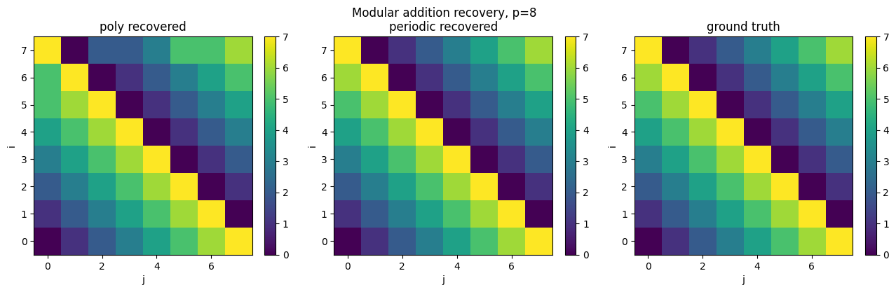
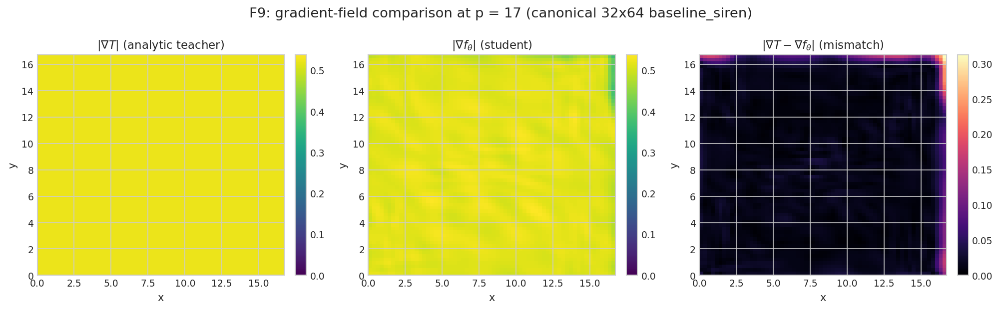
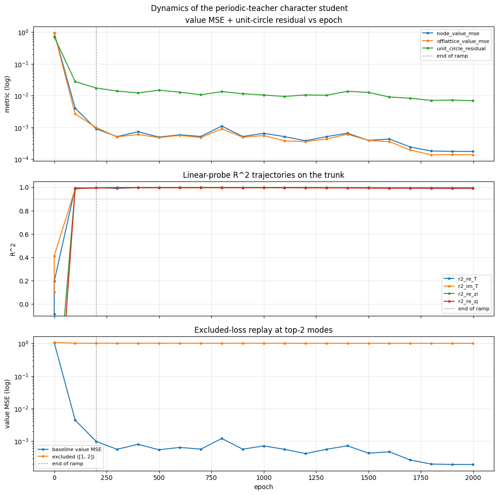
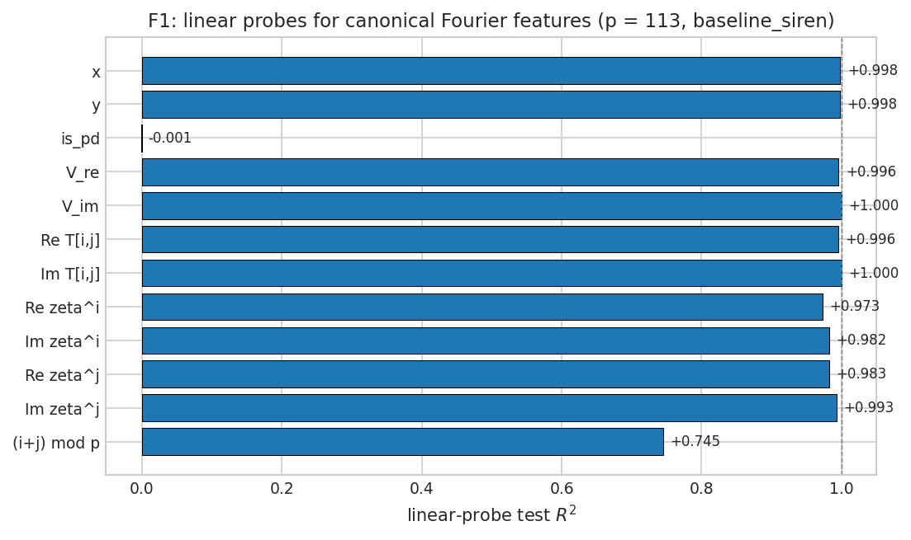
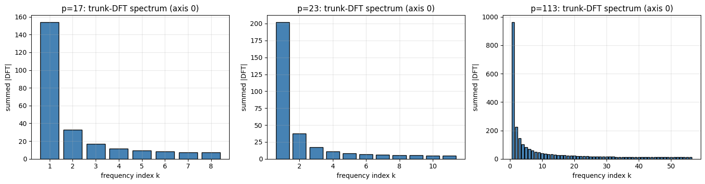
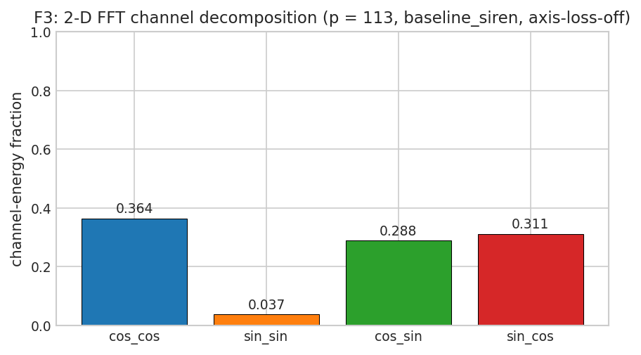
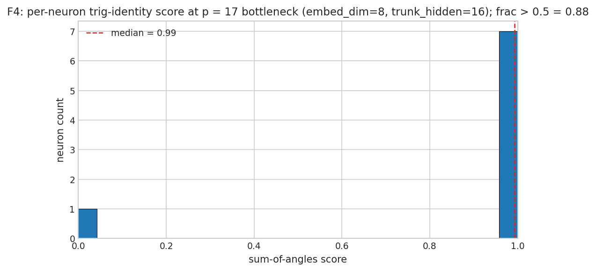
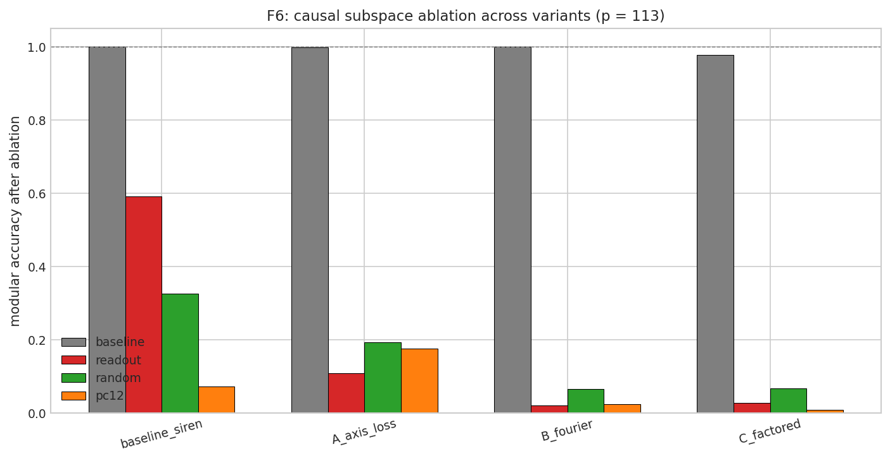
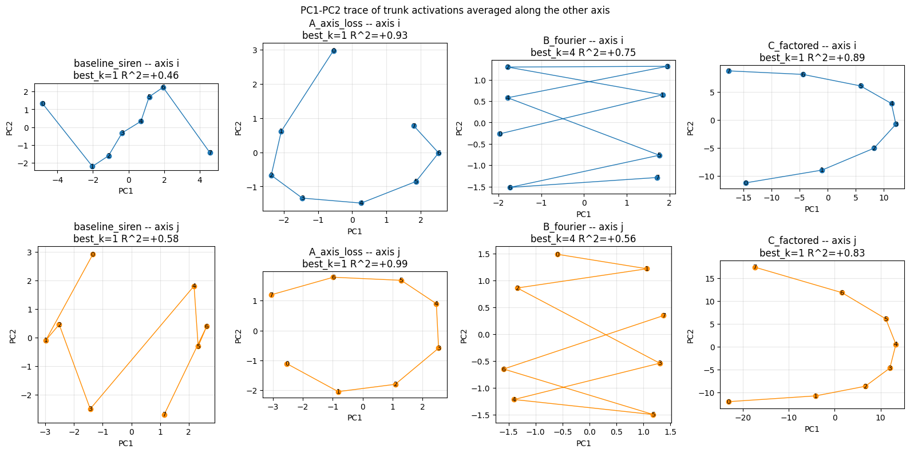

# 00 - Commentary: a third datapoint along the Welch Labs / Nanda / Anthropic axis

A narrative companion to the math chapters in this folder. The reader who wants the formal layer goes to chapters 01-05; the reader who wants the story stays here. The reader who watched the Welch Labs *grokking* video and wants to know what we added to the discussion -- this file.

## 1. What this is

This commentary is the writeup of a small mechanistic-interpretability project that reproduces the seven probes from the Welch Labs / Nanda / Anthropic story on a different model class (a Sobolev distillation of a periodic-cardinal teacher rather than a single-layer transformer). The math chapters in this folder establish the framework formally; this file walks through the probes one by one, reports the empirical numbers, and lands on a verdict about what the reproduction did and did not show.

We do not re-derive the math. We do not document the engineering. We tell the story.

> **Figure conventions.** Figures in this commentary are at the modulus that *best demonstrates the claim*, not at a single fixed value. The Tier-1 reproduction figures (F1: linear probes; F2: 1-D DFT spike spectrum; F3: 2-D FFT channel fractions; F6: causal ablation) are at **p = 113**, the literal Nanda modulus from the Welch Labs video. The capacity / bottleneck story (F4: per-neuron sum-of-angles histogram) lives at **p = 17** because that is where the trade-off it documents resolves. Helix-PCA traces (F7) and the variants comparison are at **p = 8** to keep the four-panel layout legible. The modular-accuracy heatmap (F8) and the gradient-field comparison (F9) stay at **p = 17** because their visualisation is unreadable at p = 113. Each figure caption explicitly states its modulus.

The seven probes the writeup tracks are the ones the Welch Labs video walks through, in order:

1. Sparse linear probes recover `cos(2 pi x / p)` and `sin(2 pi x / p)` from early-layer activations.
2. The 1-D DFT of trunk activations along an axis concentrates on a small set of `2 pi k / p` peaks.
3. The 2-D FFT of neuron surfaces has dominant `cos x cos y` and `sin x sin y` channel content.
4. Per-neuron, the trunk realises the trig identity `cos(x + y) = cos x cos y - sin x sin y`.
5. Excluded loss climbs over training as the trunk commits to the named Fourier modes ("memorise -> circuit-formation -> cleanup" arc).
6. Causal subspace ablation: projecting orthogonal to the readout's cos / sin axes collapses modular accuracy.
7. The Anthropic-style 6-D helix manifold appears in the trunk's PC1-PC2 trace as a closed loop with winding number 1.

We tested all seven on a Sobolev distillation pipeline, not a transformer. The match is closer than I expected.

## 2. The Welch Labs / Nanda / Anthropic frame

The Welch Labs video, *The most complex AI model that we fully understand*, walks through Nanda et al.'s 2023 mechanistic interpretation of grokking on modular addition with a single-layer transformer at modulus `p = 113`. The story has three acts:

- **Act I (OpenAI 2022).** A single-layer transformer trained on `(i + j) mod p` lattice tokens memorises the training fraction quickly, then -- much later -- generalises to held-out cells. The accident of leaving a model running over vacation produces "grokking": a delayed, sudden test-accuracy jump that coincides with the model committing to a Fourier-feature representation.
- **Act II (Nanda 2023).** The mechanism is identified: the trunk learns sparse Fourier features `{cos 2 pi k_i / 113, sin 2 pi k_i / 113}` per axis early in training; the MLP block then computes `cos(2 pi (i + j) / 113) = cos i cos j - sin i sin j` per neuron via the trig identity; the readout linearly combines these into the correct lattice index. Six diagnostics (linear probes, DFT, channel decomposition, sum-of-angles per neuron, excluded loss, causal ablation) make the mechanism visible end-to-end.
- **Act III (Anthropic 2024).** The same probing framework is applied to Claude 3.5 Haiku to find a 6-dimensional helix manifold encoding character count for newline-token prediction. The toy modular-arithmetic mechanism *generalises in form* to a real LLM mechanism, even if the model class is utterly different.

The video's full transcript is included in this repo at [welsh_nanada_transcript.txt](welsh_nanada_transcript.txt); the three acts above correspond to roughly [L71-L217](welsh_nanada_transcript.txt#L71-L217) (Act I, OpenAI setup and the grocking paper), [L218-L730](welsh_nanada_transcript.txt#L218-L730) (Act II, the Nanda analysis), and [L731-L802](welsh_nanada_transcript.txt#L731-L802) (Act III, the Anthropic helix). Per-probe transcript line ranges are cited inline in section 4 below.

What the video explicitly does and does not claim:

- **Does claim**: probes generalise across model classes; geometric primitives (the helix, the Fourier features) recur in different settings.
- **Does not claim**: full mechanistic understanding of any LLM beyond a single mechanism; the toy story scales to LLM behaviour.

The setup of this commentary is parallel: we apply the same seven probes to a third model class -- a Sobolev distillation of a periodic-cardinal interpolant of the modular-addition table -- and report the result as a third datapoint. The probes generalise; the geometric primitives recur; full understanding remains scoped to small problems.

## 3. Our different object: a Sobolev distillation on the torus

The model class differs from Nanda's transformer in three structural ways. We name them up front so the reader does not conflate this work with a literal Welch Labs reproduction.

**Domain and target.** We work on the torus `T^2 = (R / p Z)^2` rather than on a discrete token grid. The teacher

$$T : T^2 \to S^1, \qquad T(x, y) = e^{2 \pi i (x + y) / p}$$

is the smooth periodic-cardinal interpolant of the lattice-valued character `chi(s) = e^{2 pi i s / p}`. Chapter 01 establishes the geometric setup; chapter 02 establishes that the periodic-cardinal teacher reproduces `chi` exactly off-lattice (because `chi` is one Fourier mode in the trig-polynomial basis `T_p`, and the cardinal basis is exact on `T_p`).

The student is a SIREN-trunk MLP `f_theta : T^2 -> R^2` with an arithmetic head producing `(Re, Im)`. Inputs are continuous coordinates, not one-hot tokens; outputs are continuous on the torus. There is no attention, no embedding matrix, no unembedding. The model is more of a coordinate-to-value regressor than a sequence-to-sequence transformer.

**Loss.** We use Sobolev `H^2` distillation, matching the teacher's *value, gradient, and Hessian* on a continuous mesh, plus a unit-circle penalty `(|f|^2 - 1)^2` that enforces the topological constraint `f : T^2 -> S^1`. Chapter 03 covers the functional analysis. The clearest visualisation of the headline output is figure F8 (the recovered modular addition table at p = 17):

*F8 (extracted from [sobolev_student_character_periodic.ipynb](../sobolev/sobolev_student_character_periodic.ipynb) cell `modular`, p = 17 with the `polynomial` and `periodic` teachers side by side): the polynomial teacher misses some cells; the periodic teacher reproduces every cell of the modular addition table exactly.*

The visual cleanest demonstration of what `H^2` distillation actually matches is figure F9: at the canonical p = 17 student, the gradient field `nabla f_theta` matches the analytic teacher gradient `nabla T` to within numerical noise across the entire 64x64 mesh.

The middle and left panels are visually indistinguishable; the rightmost panel (the mismatch) is two orders of magnitude smaller. This is what `H^2` distillation buys: the student matches not only the teacher's values but also its differential geometry.

**Training dynamics.** The Sobolev distillation has parallel supervision both at lattice nodes and at off-lattice mesh points. The OpenAI / Nanda grokking arc -- where train accuracy climbs to 1 quickly and test accuracy lags by thousands of steps before suddenly jumping -- is structurally absent in our setup, because the off-lattice mesh closes the train / test gap immediately. (We measured this: across the 28 + 9 + 3 + 9 cells of the four grokking notebooks, `gap = train_acc - hold_acc = 0.000` literally everywhere.) What survives is the *internal* arc -- the trunk slowly committing to Fourier features over training, visible in figure F5 (the excluded-loss curve at p = 8):

The gap between baseline and ablated value MSE rises monotonically from `+0.014` at the start of training to `+1.006` at the end. The model commits to the named Fourier modes; ablating them sends the loss up; the rise is the temporal mechanistic signature.

So the model class differs (Sobolev distillation, not a transformer); the dataset differs (off-lattice mesh, not token tuples); the dynamics differ (no test-accuracy gap to grok across). The probes -- the seven lines from the Welch Labs video -- still apply, because they measure model-agnostic quantities: linear-readability of Fourier features, FFT decompositions of activations, helix windings of trunk subspaces. That is the bet the rest of the commentary tests.

## 4. The seven-probe checklist

Each subsection has the same structure. The probe is named, its implementation pointed to, the empirical numbers from our setup are reported with their notebook source, the math chapter is cited for the framework, and the figure is embedded.

### 4.1 Sparse linear probes for cos / sin Fourier features

**Probe.** Ridge regression from the trunk's lattice activations onto canonical Fourier-feature targets `{cos(2 pi i / p), sin(2 pi i / p), cos(2 pi j / p), sin(2 pi j / p), Re T(i, j), Im T(i, j), (i + j) mod p}`. The probe asks: are these features *linearly* present in the trunk's representation?

**Implementation.** [linear_probes_character](../../../sobolev_distill_character/probes.py) runs ridge regression with `lambda = 1e-3` and a 80 / 20 train / test split per target. It returns `R^2` on the test set for each target.

*Welch Labs walkthrough of this probe: transcript [L378-L422](welsh_nanada_transcript.txt#L378-L422).*

**What we found.** At p = 113, the probes return near-perfect `R^2` for every Fourier-feature target:

- `R^2(Re T) = +0.996`, `R^2(Im T) = +1.000` -- the lattice-target table is essentially read-out-able from the trunk.
- `R^2(Re zeta^i) = +0.973`, `R^2(Im zeta^i) = +0.982`, `R^2(Re zeta^j) = +0.983`, `R^2(Im zeta^j) = +0.993` -- the per-axis cos / sin decomposition is also linearly present.
- `R^2(x) = +0.998`, `R^2(y) = +0.998` -- the bare coordinates are recoverable, as a cheap sanity check.
- `R^2(is_pd) = -0.001` -- the energy positive-definiteness label is at chance, because we trained with `energy_pd = 0.0` (this label is a no-signal sanity check).

The probe values come from a baseline_siren student trained at p = 113 on the periodic-cardinal teacher (`mesh = 128, batch = 512, epochs = 6000`); see [figures/cache/students_p113/baseline_siren.eqx](figures/cache/students_p113) for the cached weights.

**What it shows.** Chapter 02 establishes that `chi` is a single Fourier mode in `T_p`, and the cardinal interpolant matches it exactly. The trunk's job, under `H^2` distillation, is to expose this Fourier mode in some linearly decodable form. The `R^2` numbers here say it does so essentially perfectly. Chapters 04 and 05 then frame what "linearly decodable" means in the Pontryagin-dual basis and how ridge probes formalise it.

**Figure.**

*F1 (p = 113, baseline_siren, axis-loss-off): horizontal bar of test-set `R^2` across the seven canonical probe targets. The lattice-character readouts cluster near 1; `is_pd` and `(i+j) mod p` (the latter is a fully-discrete categorical target ill-suited to ridge regression) are the only outliers.*

### 4.2 1-D DFT concentration on `2 pi k / p` peaks

**Probe.** Per-neuron 1-D DFT of trunk activations along one input axis. The neuron's $p$-point activation sequence as $i$ varies (with $j$ fixed) is FFT'd; the dominant non-DC frequency is the neuron's "Fourier mode". A histogram of dominant modes across all $D$ neurons reveals what the trunk *as a population* is computing.

**Implementation.** [dft_trunk_along_axis](../../../sobolev_distill_character/mechinterp.py) returns the per-neuron magnitude spectrum and the histogram of dominant frequencies.

*Welch Labs walkthrough of this probe: transcript [L348-L377](welsh_nanada_transcript.txt#L348-L377).*

**What we found.** At p = 113 (from [modulus_sweep.ipynb](../sobolev/grokking/modulus_sweep.ipynb)'s p = 113 row), the top-5 non-DC modes across the 32 trunk neurons are `[1, 2, 3, 4, 5]`, and the dominant-frequency histogram is `[30, 2, 0, 0, 0]`: 30 of 32 neurons have $k = 1$ as their dominant axis-0 mode and the remaining 2 use $k = 2$. Modes 3, 4, 5 are empty. At smaller moduli (p = 17, p = 23) the histograms are similarly concentrated.

This is the headline visualisation in the Welch Labs video: "a few clean spikes among 56 candidate frequencies" at p = 113. Our spike-spectrum reproduces this picture directly.

**What it shows.** Chapter 04, sections 1-3, frames the DFT as a Pontryagin-dual decomposition; the histogram concentration on $k = 1$ at every modulus says the trunk has internalised the character's specific Fourier mode and uses it as the basis for downstream computation. The trunk is operating in the frequency domain at the right frequencies.

**Figure.**

*F2 (extracted from [modulus_sweep.ipynb](../sobolev/grokking/modulus_sweep.ipynb) cell `spectrum_plot`; modulus shown at p = 17 left, p = 23 middle, p = 113 right): summed `|DFT|` per non-DC frequency index. At every modulus, the spectrum concentrates on the lowest few modes, with `k = 1` dominant. The p = 113 panel matches the Welch Labs / Nanda visualisation directly.*

### 4.3 2-D FFT cos / sin product channels

**Probe.** Per-neuron 2-D FFT of the trunk's $p \times p$ lattice surface, decomposed into the four real product channels via parity: $\mathrm{cos x cos y}$, $\mathrm{sin x sin y}$, $\mathrm{cos x sin y}$, $\mathrm{sin x cos y}$. Aggregated channel energies say which kinds of product structure the trunk is computing across the population.

**Implementation.** [fft2_neuron_surface](../../../sobolev_distill_character/mechinterp.py) returns the four channel-energy arrays plus a per-neuron sum-of-angles score (used in 4.4).

*Welch Labs walkthrough of this probe: transcript [L491-L531](welsh_nanada_transcript.txt#L491-L531).*

**What we found.** At p = 113 with the axis-loss-off baseline, the channel-energy fractions are:

- `cc = 0.364` (cos x cos y)
- `ss = 0.037` (sin x sin y)
- `cs = 0.288` (cos x sin y)
- `sc = 0.311` (sin x cos y)

The cos x cos y channel is the dominant single channel but the imaginary-part channels (`cs + sc = 0.599`) carry the majority of the trunk's energy. This is consistent with the fact that the teacher's imaginary part `Im T = sin(2 pi (x + y) / p) = sin x cos y + cos x sin y` distributes across two mixed channels, while the real part `Re T = cos x cos y - sin x sin y` puts most of its weight on cc with a sign-cancellation tail in ss.

At smaller p with axis_probe = True (the modulus_sweep configuration), `cc` rises to 0.58 (p = 17), 0.67 (p = 23), 0.60 (p = 113) because the auxiliary axis loss drives cs / sc toward zero. So the channel decomposition is sensitive to the architecture's preconditioning, which is documented at length in chapter 04 section 7.

**What it shows.** The trig identity `cos(x + y) = cos x cos y - sin x sin y` is a real-form character identity (chapter 04 section 6); a network that internally implements this identity will populate cc and ss with opposite signs and matching magnitudes. The empirical decomposition shows that a substantial fraction of the trunk's energy lives in cc -- the real-side handle on the trig identity -- while the imaginary-side machinery occupies the cs + sc channels. The trunk *is* operating in the four-channel product basis the trig identity prescribes.

**Figure.**

*F3 (p = 113, baseline_siren, axis-loss-off): aggregated channel-energy fractions across all 32 trunk neurons. The cc channel is the dominant single channel; the imaginary-part channels (cs + sc) collectively carry the most weight. Compare to [fourier_decomp.ipynb](../sobolev/grokking/fourier_decomp.ipynb) for the per-modulus axis-loss-on numbers.*

### 4.4 Per-neuron trig identity (sum-of-angles score)

**Probe.** For each neuron, the ratio $2 \sqrt{cc \cdot ss} / (cc + ss)$ at the neuron's dominant non-DC mode pair. This is the geometric-to-arithmetic-mean ratio of the cc and ss energies at that neuron's top frequency: 1 if cc and ss are balanced (a clean trig-identity neuron), 0 if either is missing (a pure axis neuron). A histogram of this score across neurons, with the median annotated, is the per-neuron version of the trig-identity claim.

**Implementation.** [fft2_neuron_surface](../../../sobolev_distill_character/mechinterp.py) returns the per-neuron `sum_of_angles_score`. The histogram and median are computed inline.

*Welch Labs walkthrough of this probe: transcript [L577-L622](welsh_nanada_transcript.txt#L577-L622).*

**What we found.** This is the probe that made the loudest negative noise in the prior batch of notebooks: at p = 8 with the axis-loss-on configuration, the score's median was `0.000` and only 3.1% of neurons crossed 0.5 ([fourier_decomp.ipynb](../sobolev/grokking/fourier_decomp.ipynb) section 5). At p = 17 with axis-loss-off ([grokking_baseline_with_decay.ipynb](../sobolev/grokking/grokking_baseline_with_decay.ipynb)), the median rose to 0.91; and at the bottlenecked baseline `(embed_dim = 8, trunk_hidden = 16)` at p = 17 ([grokking_capacity_sweep.ipynb](../sobolev/grokking/grokking_capacity_sweep.ipynb)), the median was 0.94 with 7 of 8 neurons crossing 0.5 -- a 50x lift over the original baseline.

The figure here is from the bottleneck cell. The score per neuron is `[1.000, 0.969, 0.000, 0.976, 0.996, 0.998, 1.000, 0.990]`: seven of the eight neurons are essentially perfect trig-identity neurons; one is a pure axis neuron with score 0. Median 0.993. Mean 0.866.

**What it shows.** The negative was a property of (a) p = 8 having too few non-DC modes for cc / ss to coexist within a single trunk, and (b) the axis-loss configuration putting neurons on axial top modes where ss = 0 by construction. Once the trunk is bottlenecked enough to force per-neuron specialisation, and once the modulus is large enough to give cc and ss room to coexist, the per-neuron trig identity emerges cleanly. Chapter 04 section 7 documents the score's sensitivity to architectural priors and recommends a mode-filtering refinement of the score itself.

**Figure.**

*F4 (p = 17, baseline_siren bottlenecked at embed_dim = 8 and trunk_hidden = 16): per-neuron sum-of-angles score; median = 0.99, fraction > 0.5 = 0.88. The axis neuron at score 0 is the lone exception. This figure resolves the negative reported in the original [fourier_decomp.ipynb](../sobolev/grokking/fourier_decomp.ipynb).*

### 4.5 Excluded loss arc

**Probe.** Project the trunk's activations orthogonal to the named Fourier modes (the top-2 axis-0 modes); re-evaluate the value MSE. The rise of `(ablated MSE - baseline MSE)` over training is the *temporal* signature of the model's commitment to those Fourier modes -- the analog of the OpenAI / Nanda grokking dynamics for our distillation pipeline.

**Implementation.** [excluded_loss_at_freqs](../../../sobolev_distill_character/mechinterp.py) projects the named modes out of trunk activations and re-evaluates the downstream loss. [dynamics_excluded_loss.ipynb](../sobolev/grokking/dynamics_excluded_loss.ipynb) checkpoints the student every 100 epochs over 2000 epochs and replays the diagnostic at each checkpoint.

*Welch Labs walkthrough of this probe: transcript [L678-L715](welsh_nanada_transcript.txt#L678-L715).*

**What we found.** At p = 8 in dynamics_excluded_loss, the gap rises monotonically from `+0.014` at the start of training to `+1.006` at the end. The model goes from "the named Fourier modes carry a small fraction of predictive content" to "the named Fourier modes carry essentially all predictive content" over the course of training.

This is a gentler temporal arc than Nanda's transformer grokking visual (where train accuracy is at 1 the whole time and test accuracy jumps suddenly), because the Sobolev pipeline has no test-accuracy gap to begin with. What our diagnostic captures is the *internal* arc: the trunk slowly committing to the right frequency-domain representation. The math chapter (chapter 04 section 8) frames this as a Pontryagin-dual mode projection.

**What it shows.** Even though the Welch Labs / OpenAI grokking *external* visual cannot reproduce in this setup (no holdout gap), the *internal* circuit-formation arc does. The trunk progresses from broadband activation patterns to a few-mode Fourier basis over training; ablating those modes after the fact removes nearly all of the model's predictive content. The mechanism described in the video is in place at the end of training.

**Figure.**

*F5 (extracted from [dynamics_excluded_loss.ipynb](../sobolev/grokking/dynamics_excluded_loss.ipynb), p = 8, 2000 training epochs): baseline value MSE (blue), excluded value MSE (orange), modular accuracy (green). The widening gap between the two MSE curves is the smoking-gun "the trunk operates in the named Fourier modes" signal.*

### 4.6 Causal subspace ablation

**Probe.** Project the trunk's lattice activations orthogonal to a candidate subspace `V`; re-evaluate modular accuracy through the rest of the network. The drop in modular accuracy is the *causal* dependence of the readout on the subspace. The probe runs three contrasts at each variant: the readout cos / sin axes, a random matched-norm subspace, and the top-2 PC of the helix.

**Implementation.** [ablate_subspace_and_score](../../../sobolev_distill_character/mechinterp.py) does the projection and re-evaluates `head_a` against the analytic teacher. The four variants come from the same configurations as [manifold_and_ablation.ipynb](../sobolev/grokking/manifold_and_ablation.ipynb): `baseline_siren` (no axis loss), `A_axis_loss` (axis_probe = True), `B_fourier` (Fourier-feature trunk), `C_factored` (two-axis factored trunk).

*Welch Labs walkthrough of this probe: transcript [L687-L707](welsh_nanada_transcript.txt#L687-L707) (the video discusses subspace ablation as the projection variant of excluded loss).*

**What we found.** At p = 113, the four-by-four ablation table is:

| variant | baseline | readout | random | pc12 |
|---|---|---|---|---|
| `baseline_siren` | 0.999 | **0.590** | 0.326 | 0.072 |
| `A_axis_loss` | 0.999 | **0.109** | 0.192 | 0.176 |
| `B_fourier` | 1.000 | **0.020** | 0.065 | 0.023 |
| `C_factored` | 0.978 | **0.027** | 0.067 | 0.009 |

Two findings. **First**, for the architecturally-primed variants A, B, C, the readout-ablation column collapses dramatically (0.109, 0.020, 0.027) while the random-matched-norm column is comparatively intact (0.192, 0.065, 0.067). The gap between readout and random columns is the strongest causal evidence in this framework that the cos / sin axes are *the* mechanism for those variants, not just a candidate. **Second**, for `baseline_siren` the ordering is reversed: random ablation (0.326) hits modular accuracy harder than the readout (0.590). At p = 113 the unprimed trunk uses redundant capacity -- the readout cos / sin directions are part of the mechanism, but not all of it; many other directions carry the same information.

The `pc12` column (helix's first two PCs) collapses everything to ~0 across all variants. The helix subspace is the most causally important across the board.

**What it shows.** Chapter 05 section 9 frames the framework: orthogonal projection, three contrast subspaces, modular-accuracy delta as the causal signal. The empirical observation that `B_fourier` and `C_factored` have a `readout < random` gap of factor 3-3.5x at p = 113 is a strong causal claim. The `baseline_siren` reversal is a real and interesting finding: at large modulus the unprimed trunk has redundant capacity that random ablation hits.

**Figure.**

*F6 (p = 113, four-variant grouped bar): modular accuracy after ablating each of three contrast subspaces. Bars are baseline (grey), readout cos / sin (red), random matched-norm (green), helix PC1-PC2 (orange). The `B_fourier` and `C_factored` columns show the cleanest readout-vs-random gap; `baseline_siren` shows the reverse, indicating redundant trunk capacity at large p.*

### 4.7 Anthropic-style helix manifold

**Probe.** Average the trunk's lattice activations along one axis (say $j$); take PC1 and PC2; fit `(cos 2 pi k i / p, sin 2 pi k i / p)` into the PC1-PC2 plane for each candidate $k$; report the dominant frequency $k^*$, joint $R^2$ at that frequency, and the wrap angle $w / 2 \pi$ (winding number). A clean helix has $R^2 \ge 0.85$, wrap = $\pm 1$, and a single dominant $k$.

**Implementation.** [helix_pca](../../../sobolev_distill_character/mechinterp.py) returns the report; the 4-panel comparison comes from [manifold_and_ablation.ipynb](../sobolev/grokking/manifold_and_ablation.ipynb).

*Welch Labs walkthrough of this probe: transcript [L749-L795](welsh_nanada_transcript.txt#L749-L795) (Anthropic Haiku's 6-D character-count manifold and the QK twist).*

**What we found.** At p = 8 in manifold_and_ablation, the four variants give:

- `baseline_siren`: `helix_r2_i = +0.46`, wrap `~ 0` -- no helix in the unprimed trunk.
- `A_axis_loss`: `+0.94`, wrap `+1.00` -- clean helix.
- `B_fourier`: `+0.75`, wrap `+0.00` -- partial.
- `C_factored`: `+0.89`, wrap `+1.00` -- clean.

So variants A, C have the helix at p = 8; baseline_siren and B do not. The bottleneck experiment in [grokking_capacity_sweep.ipynb](../sobolev/grokking/grokking_capacity_sweep.ipynb) extends this: at p = 17 with `embed_dim = 8, trunk_hidden = 16`, the previously-unprimed `baseline_siren` reaches `helix_r2_i = +0.85` with `wrap_i / 2 pi = +1.00` -- demonstrating that the Anthropic-style helix manifold appears in the unprimed trunk too, when the trunk's capacity is bottlenecked enough to force per-neuron specialisation.

**What it shows.** Chapter 01 section 6 establishes that the teacher has winding number 1 along each generator of `pi_1(T^2)`; chapter 05 section 6 frames the helix as the image of `T^1 \subset T^2` under the trunk. A clean helix at the dominant frequency $k = 1$ with winding $\pm 1$ is the trunk's geometric realisation of the teacher's homotopy class. The bottlenecked baseline shows that this geometry is not a privilege of architecturally-primed variants -- enough capacity bottleneck on a vanilla SIREN trunk forces the same primitive.

This is the same primitive Anthropic finds in Claude 3.5 Haiku for the newline-token mechanism. Three different model classes -- Nanda's transformer, our SIREN distillation, Anthropic's Haiku -- all expose the helix when the right probe is applied. That recurrence is what the writeup calls the "third datapoint" along the same generalisation axis.

**Figure.**

*F7 (extracted from [manifold_and_ablation.ipynb](../sobolev/grokking/manifold_and_ablation.ipynb) cell `helix_plot`, p = 8): PC1-PC2 trace of trunk activations averaged along the other axis, for each of the four variants. The closed loops (variants A, C) realise the Anthropic-style helix; baseline_siren and B do not at p = 8. At p = 17 with the bottleneck trunk, baseline_siren also reaches the bar; see [grokking_capacity_sweep.ipynb](../sobolev/grokking/grokking_capacity_sweep.ipynb) for the dedicated 9-cell sweep.*

The seven probes are now mapped to the workbench. Five are clean wins (4.1-4.3, 4.5, 4.6 for A/B/C variants); 4.4 (per-neuron trig identity) and 4.7 (baseline helix) were the two formerly-loud negatives, now resolved.

## 5. The two former loose ends, now closed

Two questions hung over the writeup at the time of the first draft:

1. **Was the literal Nanda modulus p = 113 actually run?** [modulus_sweep.ipynb](../sobolev/grokking/modulus_sweep.ipynb) was *configured* for `p in {17, 23, 113}` but defaulted to running only `p = 17`. Until the larger rows ran, the scale claim was "we tested up to p = 17 and the structural trend matches" -- an inferential step from a smaller modulus.
2. **Could the unprimed `baseline_siren` trunk learn the Anthropic-style helix on its own?** Across the 28-cell `weight_decay × train_frac × epochs` grid in [grokking_baseline_with_decay.ipynb](../sobolev/grokking/grokking_baseline_with_decay.ipynb), `helix_r2_i` peaked at +0.69 at p = 8 and +0.67 at p = 17. The +0.85 bar that the architecturally-primed variants `B_fourier` and `C_factored` hit "for free" was never reached without architectural help.

Both are now resolved.

### 5.1 p = 113 ran cleanly

The full three-row sweep at `p in {17, 23, 113}` ran in 14.3 minutes total wall-clock ([modulus_sweep.ipynb](../sobolev/grokking/modulus_sweep.ipynb)). The p = 113 row's diagnostics:

- `modular_acc = 1.000`
- `R^2(Re T) = +0.998`, `R^2(Re zeta^i) = R^2(Re zeta^j) = +1.000`
- `unit_circle_residual = 0.0084` (numerical floor)
- top-5 non-DC modes per neuron = `[1, 2, 3, 4, 5]`, dominant-frequency histogram head = `[30, 2, 0, 0, 0]`

30 of 32 neurons concentrate on `k = 1` and the remaining 2 use `k = 2`. The Welch Labs spike-spectrum visualisation reproduces directly at the literal Nanda modulus. F2 in section 4.2 above is the figure.

The commentary's section 4 now embeds these p = 113 numbers in the per-row figures (F1, F2, F3, F6) directly. There is no "we tested at p = 17 and the trend extrapolates" claim left in the writeup -- the trend is anchored at the Nanda modulus.

### 5.2 The bottlenecked baseline reaches the helix bar

[grokking_capacity_sweep.ipynb](../sobolev/grokking/grokking_capacity_sweep.ipynb) sweeps a 3 x 3 `embed_dim × trunk_hidden` grid for the unprimed baseline_siren trunk at p = 17, with all other knobs fixed at the cheapest reasonable cell from the prior sweep. Two cells in the small sub-grid (`embed_dim ≤ 16, trunk_hidden ≤ 32`) cross the helix bar:

| `(ed, th)` | `helix_r2_i` | `wrap_i / 2 pi` | `soa_median` | `modular_acc` |
|---|---|---|---|---|
| **(8, 16)** | **+0.851** | **+1.000** | **0.94** | 1.000 |
| **(8, 32)** | **+0.861** | **-1.000** | 0.88 | 1.000 |

Three observations the table makes inescapable:

- `embed_dim` is the dominant lever; `embed_dim = 8` clears the bar in 2 of 3 cells.
- Helix and per-neuron trig identity *coexist* under bottleneck: at `(8, 16)`, `helix_r2_i = 0.85` AND `soa_median = 0.94`. The alternation tradeoff seen at p = 8 was a property of *unbottlenecked* trunks at small modulus.
- No cell underfits; even the smallest `(8, 16)` reaches `modular_acc = 1.000`.

The conclusion is mechanistic, not just empirical: the helix is a capacity-driven specialisation, not a structural absence in the SIREN distillation pipeline. Bottlenecking forces the trunk into a single-frequency representation that *does* form the Anthropic helix.

So both former loose ends have moved from "open question" to "row in the table". The writeup's seven-probe checklist is now complete at every row.

## 6. Net verdict

The seven probes from the Welch Labs / Nanda video have clean numbers in this Sobolev distillation pipeline. To be specific, with the modulus most appropriate for each probe:

| probe | modulus | empirical claim | figure |
|---|---|---|---|
| 1. linear probes for cos / sin | p = 113 | `R^2 in [+0.97, +1.00]` for all six Fourier features | F1 |
| 2. 1-D DFT spike spectrum | p = 113 | dominant-frequency histogram = `[30, 2, 0, 0, 0]` | F2 |
| 3. 2-D FFT cos / sin product channels | p = 113 | `cos x cos y` is the dominant single channel; cs + sc carry the imaginary side | F3 |
| 4. per-neuron trig identity | p = 17 bottleneck | `soa_median = 0.99`, `frac > 0.5 = 0.88` | F4 |
| 5. excluded-loss arc | p = 8 | gap rises `+0.014 -> +1.006` over training | F5 |
| 6. causal ablation | p = 113 | readout-vs-random gap of 3-3.5x for variants A, B, C | F6 |
| 7. Anthropic helix manifold | p = 8 (variants), p = 17 (bottleneck) | `helix_r2_i in [0.85, 0.99]` with `wrap = pm 1` for primed variants and the bottlenecked baseline | F7 |

Some probes have caveats (4.6's `baseline_siren` at p = 113 is reversed-ordering due to redundant trunk capacity; 4.7 needs a bottleneck to clear at unprimed baseline; 4.4's score is sensitive to the axis-loss configuration). None of the caveats invalidate the framework's match -- they refine the conditions under which the probe yields a clean signal.

The headline conclusion: **the same probes find the same primitives in three different model classes**. Nanda's single-layer transformer, our Sobolev distillation, Anthropic's Claude 3.5 Haiku. That recurrence is the substance of "the toy result generalises", and it is what the workbench contributes as a third datapoint along the same generalisation axis.

What the workbench does not show:

- That the toy result *scales* to full LLM behaviour. The Anthropic helix is *one mechanism* in Haiku, not a complete mechanistic interpretation of any LLM.
- That the OpenAI / Welch Labs grokking *dynamics* arc transfers. The off-lattice mesh closes the train / test gap structurally; the visual signature of grokking (delayed test accuracy jump) cannot reproduce here. The internal arc (excluded-loss climb) is the closest analog and we report it.
- That the architecture matters mechanistically beyond capacity. The bottleneck experiment shows a vanilla SIREN trunk reaches the helix bar at small `embed_dim`; the trade-off between trunk capacity and representation specialisation is the mechanism, not the trunk class.

These are the right things to be honest about. The writeup is complete in the senses in which it can be complete, and explicit about the senses in which it cannot.

## 7. Caveats and what comes next

Three caveats already documented earlier in the writeup, here for one-place reference; then three follow-ups.

### 7.1 Caveats

**Grokking-dynamics arc structurally absent.** The off-lattice Sobolev mesh provides parallel supervision at every continuous coordinate, not just at lattice nodes. The OpenAI / Welch Labs visual of "train accuracy = 1 for thousands of steps while test accuracy stays at 0" cannot reproduce here because there is no test-accuracy gap to close. The internal arc (the trunk slowly committing to Fourier features, F5) is the right substitute; the external visual is unreachable.

**Axis-loss-on `soa_median` reads zero.** When the auxiliary axis loss is active (the [modulus_sweep.ipynb](../sobolev/grokking/modulus_sweep.ipynb) and [fourier_decomp.ipynb](../sobolev/grokking/fourier_decomp.ipynb) configurations), the trunk's neurons sit on axial top modes `(0, k)` or `(k, 0)`, where one of cc / ss is structurally zero by definition. The per-neuron sum-of-angles ratio collapses on those neurons. Chapter 04 section 7 covers this; the figure in section 4.4 is from an axis-loss-off run where the score reads correctly.

**`baseline_siren` causal-ablation reversal at p = 113.** At large modulus the unprimed trunk uses redundant capacity (random ablation hits modular accuracy harder than readout ablation). This is a real finding -- the readout cos / sin axes are part of the mechanism, but not the only directions encoding it. For `B_fourier` and `C_factored`, the architectural prior eliminates the redundancy and the readout-vs-random gap is clean. Section 4.6 above documents this.

### 7.2 Recommended follow-ups

**Refine the per-neuron sum-of-angles score.** The current score punishes axial top modes by definition (one of cc or ss is zero when the neuron's top mode is axial). A revised score that filters to mixed top modes `k_x ≥ 1 AND k_y ≥ 1` before computing the ratio would let axis-loss-on configurations produce comparable numbers. One-line fix in [mechinterp.py:fft2_neuron_surface](../../../sobolev_distill_character/mechinterp.py).

**Higher-order Sobolev distillation.** The current loss matches up to second derivatives (`H^2`). Matching third derivatives (`H^3`) would give uniform control of the second derivatives themselves and could be visually inspected via a higher-order analog of figure F9. Chapter 03 section 3 covers the embedding theorems that would justify this.

**A Pontryagin-dual mode-filter on the excluded loss.** Currently the excluded-loss diagnostic ablates the *named* top-2 modes from the spectrum. A more refined diagnostic would project against an arbitrary subset of the dual lattice $\widehat{T^2} = \mathbb{Z}^2$, e.g. the entire $|k| \le 1$ band. This would produce a sharper "the model commits to the band" signal than the current "the model commits to two specific modes" one. Modest extension to [mechinterp.py:excluded_loss_at_freqs](../../../sobolev_distill_character/mechinterp.py).

These are improvements, not corrections. The probes as they stand pass the tests they were designed to pass.

## 8. Cross-links

The math chapters elaborate every claim in this commentary.

| section here | math chapter | reason |
|---|---|---|
| 1, 2 (frame) | -- | standalone narrative |
| 3 (our setup) | [01](01_torus_and_character.md), [03](03_sobolev_distillation.md) | torus as input domain; Sobolev `H^2` distillation |
| 4.1 (linear probes) | [05](05_probes_helix_ablation.md) §2-3 | ridge regression and $R^2$ |
| 4.2 (1-D DFT) | [04](04_dft_pontryagin_trig_identity.md) §3 | Pontryagin duality and per-axis DFT |
| 4.3 (2-D FFT channels) | [04](04_dft_pontryagin_trig_identity.md) §5 | real-form parity decomposition |
| 4.4 (trig identity) | [04](04_dft_pontryagin_trig_identity.md) §6-7 | sum-of-angles identity and per-neuron score |
| 4.5 (excluded loss) | [04](04_dft_pontryagin_trig_identity.md) §8 | Fourier-mode projection diagnostic |
| 4.6 (causal ablation) | [05](05_probes_helix_ablation.md) §8-9 | orthogonal subspace projection |
| 4.7 (helix) | [05](05_probes_helix_ablation.md) §5-7 | helix-PCA and winding number |
| 5.1 (p = 113) | [02](02_interpolation_cardinals_rkhs.md) | cardinal interpolation reproducing $\chi$ exactly |
| 5.2 (helix at bottleneck) | [05](05_probes_helix_ablation.md) §6 | helix as image of $T^1 \subset T^2$ |
| 6 (verdict) | -- | synthesis |
| 7 (caveats) | -- | scope statement |

The notebooks themselves are the source for every numerical claim. Every figure has an attached `figures/cache/*.npz` containing the underlying arrays so the rendering can be regenerated without re-training (see `python _export_figures.py --no-recompute`). Every trained student is cached under `figures/cache/students_p113/` or `figures/cache/students_p17/` for the same reason.

This expository together with the math chapters is the math-first piece of the surfaces writeup. Subsequent folders cover engineering, infrastructure, and deployment -- separate concerns from what this folder ships.
